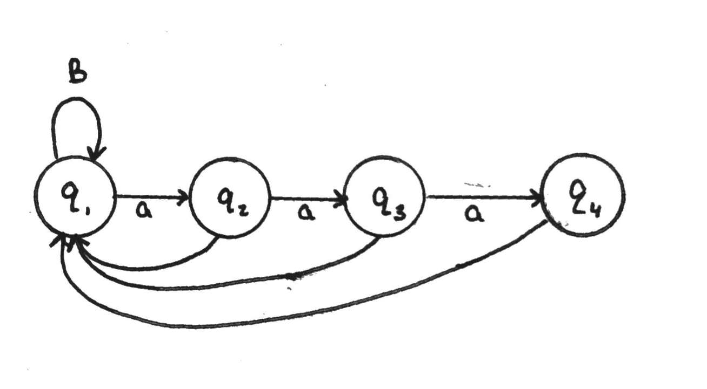

# Finite Automata

**Lecture 2 - January 9, 2017**

We use **finite automata** to model systems with a fixed number of states.

#### Example

A door controller is a finite automata. Suppose it has three components:

* Front Pad
* Door
* Rear Pad.

The door has two possible **states**, `OPEN` or `CLOSED`. There are four possible **signals** (or **inputs**):

* `FRONT`
* `REAR`
* `BOTH`
* `NEITHER`

We can represent this with a state diagram.

## A Finite Automaton

_definition_: A **finite automaton (FA)** is a structure, for a machine $M$, $M = (Q, \Sigma, \delta, q_0, F)$, where

* $Q = \{q_1, q_2, \ldots\}$ is a finite **set of states**
* $\Sigma$ is the **input symbols** or alphabet
* $\delta$ is the **transition function**
* $q_0 \in Q$ is the **starting state**
* $F \subseteq Q$ is the set of **accept states** or **final states**

The language of the machine $M$ is the set $L$ of all strings $M$ accepts.

### Computation or Acceptance

_definition_: Given a finite automaton $M = (Q, \Sigma, \delta, q_0, F)$, a string $w$ over $\Sigma$ where $w = w_1 w_2 \ldots w_n$.

Then $M$ **accepts** $w$ if there is a sequence of states $r_0,r_1,\ldots,r_n$ in $Q$ such that

#### Example

*Construct a finite automaton accepting the following language:*

$$\begin{aligned}
    \{ x \in \{a,b\}^* | \text{ $x$ contains a substring of 3 consecutive $a$'s} \}
\end{aligned}$$

## Closure

_definition_: A set is **closed** under an operation if the result of the operation on an element of the set is also an element of the set.

### Theorem

If $L_1$ and $L_2$ are regular languages then so is $L_1 \cup L_2$.
